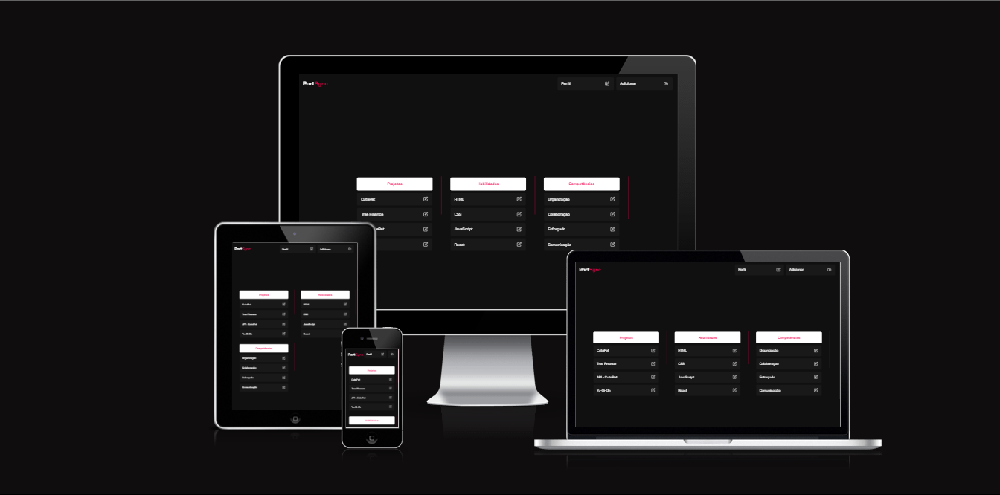
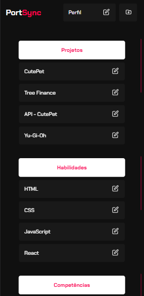
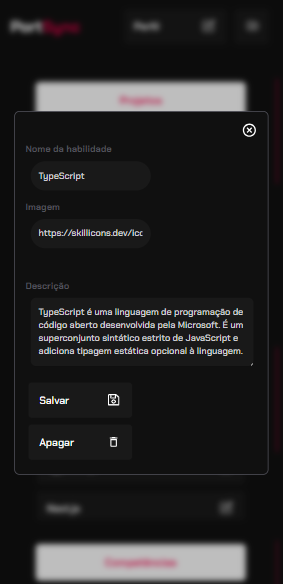
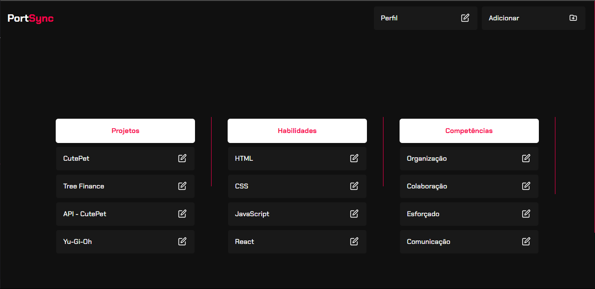
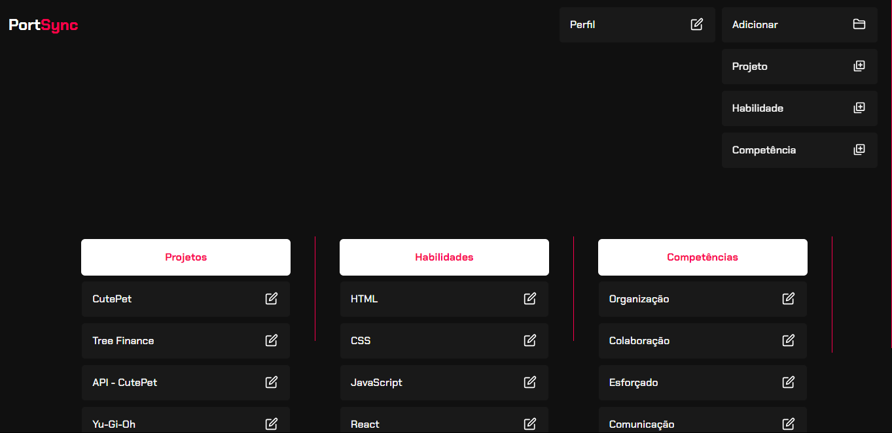
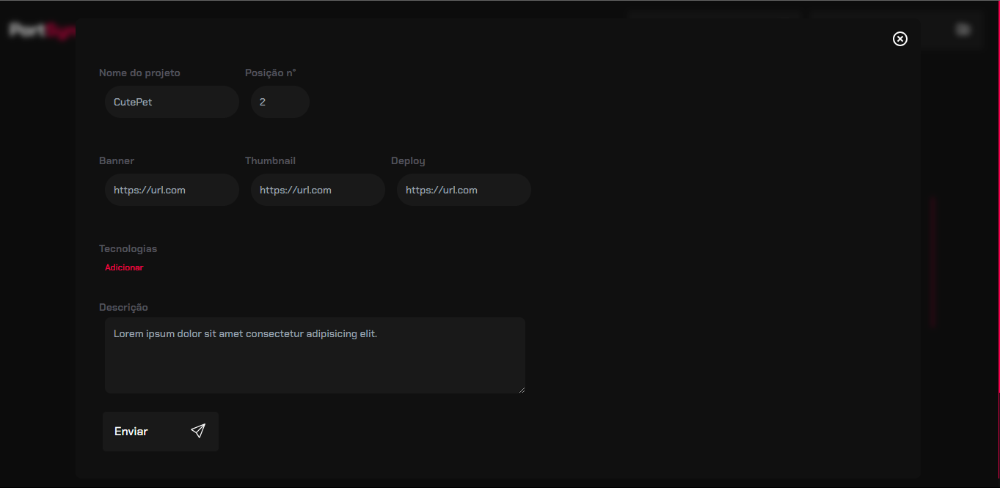
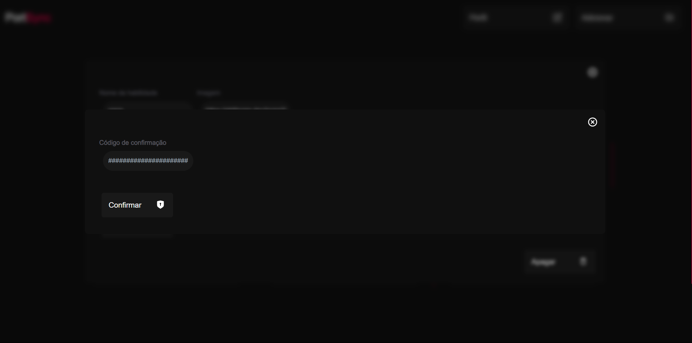

</h1>
   
<h1>PortSync</h1> 

## Descrição

### 🚀 Apresento o [PortSync](https://portsync.vercel.app) - um sistema completo que desenvolvi para gerenciar meu portfólio! Depois de refatorar meu portfólio para o [Next.js](https://nextjs.org), criei uma [API](https://github.com/renovatt/portfolio-api.git) para consumir os dados e, finalmente, desenvolvi o PortSync exclusivamente para esse propósito.

### Com ele, posso realizar todas as operações CRUD, enviando novos projetos, habilidades e competências, atualizando informações e até mesmo excluindo registros. Para garantir a segurança, utilizei a criptografia nativa do Node.js ([crypto](https://nodejs.org/api/crypto.html)) para criar uma barreira de proteção, exigindo um código de segurança para acessar e alterar dados, proporcionando total controle sobre as informações.

### Estou orgulhoso dessa conquista e feliz por ter meu próprio sistema de gerenciamento integrado ao meu portfólio. O PortSync possui uma interface simples e intuitiva, com destaque para o uso de modais que o torna visualmente atraente, e as cores harmonizam perfeitamente com o estilo do [WillCode](https://portfolio-renovatt.vercel.app).

[Ver Projeto](https://portsync.vercel.app)

#

#

## Layout mobile

## Layout web
#

#

#

#

 

## 🛠️ Tecnologias

💻 **Front-end**
- [Next.js 13.4](https://nextjs.org)
- [Typescript](https://www.typescriptlang.org)
- [crypto](https://nodejs.org/api/crypto.html)

📚 **Bibliotecas**
- [zod](https://zod.dev/)
- [next-pwa](https://www.npmjs.com/package/next-pwa)
- [react-hook-form](https://react-hook-form.com/)
- [react-toastify](https://www.npmjs.com/package/react-toastify)
- [react-icons](https://react-icons.github.io/react-icons/)

🎨 **Estilização**
- [tailwindcss](https://tailwindcss.com/docs/installation)

🔋 **Versionamento e Deploy**
- [Git](https://git-scm.com)
- [Vercel](https://vercel.com/)

 

⚙️ **Configuranções e Instalações**

Clone do Projeto

    $ git clone https://github.com/renovatt/portsync.git

Instalando as dependências

    $ npm install

Iniciando o projeto

    $ npm run dev

 

**Como contribuir?**

- Você pode dar suporte me seguindo aqui no GitHub
- Dando uma estrela no projeto
- Criar uma conexão comigo no linkedin fazendo parte da minha networking e curtir o meu projeto.

<!--   -->

**Autor**
[Wildemberg Renovato de Lima](https://www.linkedin.com/in/renovatt/)